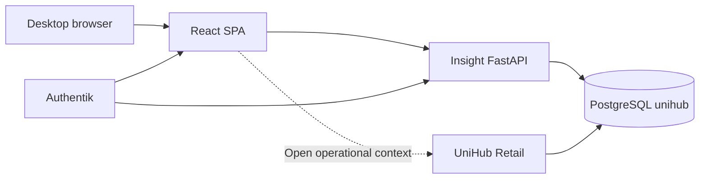

# UniHub Insight — Application Architecture

## Role

UniHub Insight is the desktop analytical sister application of UniHub Retail. Retail owns operational writes, imports and configuration. Insight owns read-only exploration, comparisons, dashboards, drill-down and planning views.

## System context



## Runtime components

| Component | Responsibility |
| --- | --- |
| `apps/web` | Desktop shell, URL state, widgets, charts, tables, layout editing |
| `apps/api` | Read-only analytical contracts, scope validation, RBAC boundary, queries |
| PostgreSQL `unihub` | Canonical Retail reporting models and later Insight-owned layout metadata |
| Authentik | Shared identity and claims; BFF integration enters before live deployment |

## Frontend boundaries

```text
app/                 shell, router, navigation, global filters
features/overview/   first end-to-end analytical feature
features/module/     bounded placeholders for roadmap modules
components/charts/   ECharts adapter and lifecycle
components/dashboard grid/layout and widget chrome
components/ui/       generic states
lib/                 API client, URL state, formatting, environment
```

Rules:

- Global filters are URL search parameters and survive navigation/share/reload.
- Server state belongs to TanStack Query; local UI state stays local.
- Dashboard layout is independent from analytical data.
- ECharts is registered modularly and loaded with the analytical route.
- Widget definitions are catalog entries, not hard-coded page markup.
- Desktop canvas uses 24 logical columns and no global max-width.

## API boundaries

```text
api/routes/          HTTP transport and status mapping
api/dependencies.py  normalized analytical scope
services/            period/scope and metric orchestration
repositories/base.py repository protocol
repositories/demo.py deterministic development adapter
repositories/postgres.py approved read-only SQL
domain/models.py     public Pydantic contracts
```

The API exposes:

- `GET /livez` — process only;
- `GET /readyz` — PostgreSQL read-only readiness in live mode;
- `GET /api/v1/filters/options` — periods and dependent dimensions;
- `GET /api/v1/overview` — one coherent Overview payload;
- `GET /api/v1/catalog/metrics` — initial canonical metric definitions.

## Data path

1. Router validates query shape and finite comparison mode.
2. Scope dependency deduplicates and preserves store ordering.
3. Repository reads approved Retail reporting models.
4. Repository computes only contracted metrics and explicit comparisons.
5. Pydantic validates the response.
6. Web validates JSON again with Zod before rendering.
7. Query cache keys include the complete normalized scope.

## PostgreSQL read boundary

The first adapter uses existing canonical Retail sources:

- `reporting_agent_day`;
- `reporting_agent_month`;
- `store_targets`;
- `import_snapshots`.

Connection safeguards:

- dedicated read-only role;
- `default_transaction_read_only=on` at role and session level;
- bounded pool;
- statement, lock and idle transaction timeouts;
- parameterized queries;
- readiness verifies the connection is actually read-only.

## Performance model

| Surface | Initial budget |
| --- | --- |
| Overview API warm p95 | < 1,000 ms |
| Normal analytical API p95 | < 2,000 ms |
| Request hard budget | 2,500 ms default |
| Interaction | no long task > 200 ms in normal use |
| Layout operation | immediate, no network dependency |

Optimization order: measure; remove duplicate work; use canonical daily/monthly aggregates; add index/materialization only with `EXPLAIN (ANALYZE, BUFFERS)` evidence; introduce cache or another datastore only after a proven bottleneck.

## Authentication and authorization

Development starts in deterministic demo mode. Before production, reuse Authentik identity and groups, enforce access in API dependencies, isolate salary/P&L contracts, keep audit events free of sensitive values, and preserve contextual deep-links to Retail for writes.

## Evolution

The first Overview is deliberately a vertical slice. New modules reuse the same URL scope, response metadata, metric definitions, widget chrome and performance gates instead of creating separate mini-applications.
