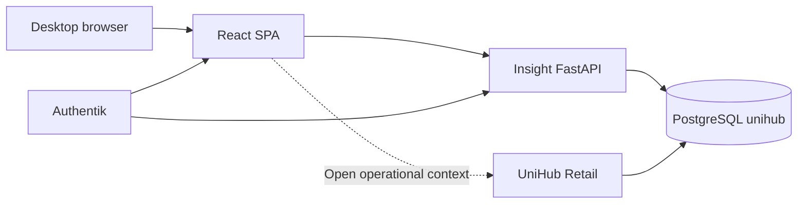

# UniHub Insight — Application Architecture

## Role

UniHub Insight is the desktop analytical sister application of UniHub Retail. Retail owns operational writes, imports and configuration. Insight owns read-only exploration, comparisons, dashboards, drill-down and planning views.

## System context



## Runtime components

| Component | Responsibility |
| --- | --- |
| `apps/web` | Desktop shell, URL state, widgets, charts, tables, layout editing |
| `apps/api` | Read-only analytical contracts, scope validation, RBAC boundary, queries |
| PostgreSQL `unihub` | Canonical Retail reporting models plus Insight-owned dashboard metadata |
| Authentik + Caddy | Live public identity boundary; Caddy serves SPA, forwards verified identity and proxies API over private UDS |

## Frontend boundaries

```text
app/                   shell, router, navigation, global filters
features/overview/     live executive overview
features/monthly-review rich historical monthly analysis
features/modules/      sub-view-uri de domeniu peste primitive analitice comune
features/dashboards/   persisted custom dashboard library/editor/preview
features/identity/     verified user/capability context
components/charts/   ECharts adapter and lifecycle
components/dashboard grid/layout and widget chrome
components/ui/       generic states
lib/                 API client, URL state, formatting, environment
```

Rules:

- Global filters are URL search parameters and survive navigation/share/reload.
- Server state belongs to TanStack Query; local UI state stays local.
- Dashboard layout is independent from analytical data.
- ECharts is registered modularly and loaded with the analytical route.
- Widget definitions are catalog entries, not hard-coded page markup.
- Desktop canvas uses 24 logical columns and no global max-width.

## API boundaries

```text
api/routes/          HTTP transport and status mapping
api/dependencies.py  normalized analytical scope
services/            period/scope and metric orchestration
repositories/base.py repository protocol
repositories/demo.py deterministic development adapter
repositories/postgres.py approved read-only SQL
domain/models.py     public Pydantic contracts
```

The API exposes:

- `GET /livez` — process only;
- `GET /readyz` — PostgreSQL read-only readiness in live mode;
- `GET /api/v1/filters/options` — periods and dependent dimensions;
- `GET /api/v1/overview` — one coherent Overview payload;
- `GET /api/v1/modules/{module}` — contractul nativ al modulului, cu interval finit și metadata explicită;
- `POST /api/v1/query/batch` — maximum 12 widgeturi pe același snapshot eligibil;
- `POST /api/v1/query/inspect` și `/query/export.csv` — exact query-ul widgetului și același snapshot;
- `GET /api/v1/monthly-review` — raportul lunar istoric;
- `GET /api/v1/catalog/metrics` — definiții canonice inițiale;
- `/api/v1/dashboards` — CRUD metadata cu optimistic concurrency;
- `/api/v1/exports/*` — XLSX pentru Overview, module și raport lunar;
- `GET /api/v1/me` — identitate și capabilități verificate server-side.

`/metrics` și ingestia RUM sunt suprafețe interne. API-ul public direct rămâne închis; traficul public intră prin Caddy/Authentik.

## Data path

1. Router validates query shape and finite comparison mode.
2. Scope/window dependencies normalizează magazinele, intervalul și comparațiile cerute.
3. Resolverul de snapshot fixează generațiile eligibile per domeniu pentru query batch.
4. Repository citește numai reporting models aprobate și query-uri parametrizate.
5. Serviciile validează metrică × dimensiune × grain × chart și aplică deadline comun.
6. Pydantic validează răspunsul; web-ul îl validează din nou cu Zod.
7. Query cache keys includ scope-ul și fereastra normalizate complet.

## PostgreSQL read boundary

Adaptorul live folosește numai surse Retail aprobate, între care:

- `reporting_agent_day`;
- `reporting_agent_month`;
- `reporting_item_month` și reporting categorie/Focus/lifecycle/profile;
- targeturi agent/magazin și magazine;
- status Grile și read-model-urile v1 pentru Campaigns, Workforce, Compensation, Visits, Finance și Planning;
- `import_snapshots` pentru coverage/cutoff unde contractul îl cere.

Compensation citește exclusiv agregatul aprobat și nu expune persoane sau filtre diferențiatoare. Granturile raw Finance/Planning păstrate pentru compatibilitatea N/N-1 se revocă numai după două release-uri de produs acceptate și rollback B→A; API-ul Insight nu le folosește.

Connection safeguards:

- dedicated read-only role;
- `default_transaction_read_only=on` at role and session level;
- bounded pool;
- statement, lock and idle transaction timeouts;
- parameterized queries;
- readiness verifies the connection is actually read-only.

## Performance model

| Surface | Initial budget |
| --- | --- |
| Overview API warm p95 | < 1,000 ms |
| Normal analytical API p95 | < 2,000 ms |
| Request hard budget | 2,500 ms default |
| Interaction | no long task > 200 ms in normal use |
| Layout operation | immediate, no network dependency |

Optimization order: measure; remove duplicate work; use canonical daily/monthly aggregates; add index/materialization only with `EXPLAIN (ANALYZE, BUFFERS)` evidence; introduce cache or another datastore only after a proven bottleneck.

## Authentication and authorization

Producția reutilizează Authentik și grupul aplicației; numai utilizatorii autorizați ajung la SPA, iar API-ul recalculează capabilitățile pentru analytics, management, HR, P&L și admin. Capabilitățile sunt verificate la endpoint, dashboard, inspect și export; ascunderea UI nu este control de securitate. Logurile/auditul nu conțin salarii, CNP sau valori sensibile. Acțiunile operaționale rămân deep-link contextual către Retail.

Modul demo determinist există numai pentru dezvoltare/test și nu dovedește matricea reală Authentik.

## Evolution

### Baseline live

Overview și Monthly Review sunt suprafețe distincte. Cele șapte module au sub-view-uri și rețete proprii, dar unele folosesc încă aceleași primitive și nu acoperă toate contractele din plan. Custom Dashboards folosește batch, versionare, ACL per subject și scope ceiling; editorul multi-dimensiune rămâne parțial.

### Arhitectura țintă

Retail publică read-model-uri versionate. Insight rezolvă un `analytical_snapshot_id`, apoi un query batch finit execută 8–12 widgeturi cu deadline comun, deduplicare și eroare izolată. Catalogul versionat de metrici/dimensiuni și `ChartSpec` alimentează identic modulele specializate, custom dashboards, inspectorul server-side și exporturile. Metadata de cutoff/finalitate rămâne per domeniu; nicio pagină Finance/HR/Planning nu moștenește metadata Sales.

Detaliile, ordinea de dependență și porțile sunt canonice în [Planul integrat](docs/PLAN_DEZVOLTARE_INTEGRAT.md).
