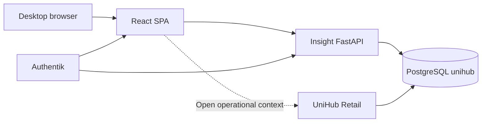

# UniHub Insight — Application Architecture

## Role

UniHub Insight is the desktop analytical sister application of UniHub Retail. Retail owns operational writes, imports and configuration. Insight owns read-only exploration, comparisons, dashboards, drill-down and planning views.

## System context



## Runtime components

| Component | Responsibility |
| --- | --- |
| `apps/web` | Desktop shell, URL state, widgets, charts, tables, layout editing |
| `apps/api` | Read-only analytical contracts, scope validation, authenticated full-data boundary, queries |
| PostgreSQL `unihub` | Canonical Retail reporting models plus Insight-owned dashboard metadata |
| Authentik + Caddy | Live public identity boundary; Caddy serves SPA, forwards verified identity and proxies API over private UDS |

## Frontend boundaries

```text
app/                   shell, router, navigation, global filters
features/overview/     live executive overview
features/monthly-review rich historical monthly analysis
features/modules/      sub-view-uri de domeniu peste primitive analitice comune
features/dashboards/   persisted custom dashboard library/editor/preview
features/identity/     verified allowlisted-user context
components/charts/   ECharts adapter and lifecycle
components/dashboard grid/layout and widget chrome
components/ui/       generic states
lib/                 API client, URL state, formatting, environment
```

Rules:

- Global filters are URL search parameters and survive navigation/share/reload.
- Server state belongs to TanStack Query; local UI state stays local.
- Dashboard layout is independent from analytical data.
- ECharts is registered modularly and loaded with the analytical route.
- Widget definitions are catalog entries, not hard-coded page markup.
- Desktop canvas uses 24 logical columns and no global max-width.

## API boundaries

```text
api/routes/          HTTP transport and status mapping
api/dependencies.py  normalized analytical scope
services/            period/scope and metric orchestration
repositories/base.py repository protocol
repositories/demo.py deterministic development adapter
repositories/postgres.py approved read-only SQL
domain/models.py     public Pydantic contracts
```

The API exposes:

- `GET /livez` — process only;
- `GET /readyz` — PostgreSQL read-only readiness in live mode;
- `GET /api/v1/filters/options` — periods and dependent dimensions;
- `GET /api/v1/overview` — one coherent Overview payload;
- `GET /api/v1/modules/{module}` — contractul nativ al modulului, cu interval finit și metadata explicită;
- `POST /api/v1/query/batch` — maximum 12 widgeturi pe același snapshot eligibil;
- `POST /api/v1/query/inspect`, `/query/export.csv` și `/query/export.xlsx` — exact query-ul widgetului și același snapshot;
- `GET /api/v1/monthly-review` — raportul lunar istoric;
- `GET /api/v1/catalog/metrics` — definiții canonice inițiale;
- `/api/v1/dashboards` — CRUD metadata cu optimistic concurrency;
- `/api/v1/exports/*` — XLSX pentru Overview, module și raport lunar;
- `GET /api/v1/me` — identitate, allowlist și acces complet verificate server-side.

`/metrics` și ingestia RUM sunt suprafețe interne. API-ul public direct rămâne închis; traficul public intră prin Caddy/Authentik. Metricile HTTP și RUM au numai etichete finite `source_sha`, `traffic_class` și `surface`: identitățile de load/smoke/E2E sunt `synthetic`, health-ul este `system`, iar numai un subject Authentik verificat și ne-rezervat intră în poarta `real`.

## Data path

1. Router validates query shape and finite comparison mode.
2. Scope/window dependencies normalizează magazinele, intervalul și comparațiile cerute.
3. Resolverul de snapshot fixează sursa coerentă și provenance per domeniu; preferă autoritatea promovată, fără să ascundă rândurile canonice legacy/estimate/draft.
4. Repository citește numai reporting models versionate complete și query-uri parametrizate.
5. Serviciile validează metrică × dimensiune × grain × chart și aplică deadline comun.
6. Pydantic validează răspunsul; web-ul îl validează din nou cu Zod.
7. Query cache keys includ scope-ul și fereastra normalizate complet.

## PostgreSQL read boundary

Adaptorul live folosește numai surse Retail aprobate, între care:

- `reporting_agent_day`;
- `reporting_agent_month`;
- `reporting_item_month` și reporting categorie/Focus/lifecycle/profile;
- targeturi agent/magazin și magazine;
- status Grile, read-model-urile v1 pentru Campaigns, Workforce, Compensation, Finance și Planning și contractul Visits v2 pe autor Team Leader;
- `import_snapshots` pentru coverage/cutoff unde contractul îl cere.

Compensation consumă un read-model Retail complet, versionat și read-only, care păstrează persoana, valorile/componentele salariale și dimensiunile de analiză necesare. Finance consumă aceeași sursă canonică acceptată de Retail și păstrează `actual`/`estimated`; lipsa unui head tehnic nu ascunde rânduri pe care Retail le afișează deja. API-ul nu are nevoie de acces SQL arbitrar la tabelele raw dacă read-model-urile complete publică aceste date.

Connection safeguards:

- dedicated read-only role;
- `default_transaction_read_only=on` at role and session level;
- bounded pool;
- statement, lock and idle transaction timeouts;
- parameterized queries;
- readiness verifies the connection is actually read-only.

## Performance model

| Surface | Initial budget |
| --- | --- |
| Overview API warm p95 | < 1,000 ms |
| Normal analytical API p95 | < 2,000 ms |
| Request hard budget | 2,500 ms default |
| Interaction | no long task > 200 ms in normal use |
| Layout operation | immediate, no network dependency |

Optimization order: measure; remove duplicate work; use canonical daily/monthly aggregates; add index/materialization only with `EXPLAIN (ANALYZE, BUFFERS)` evidence; introduce cache or another datastore only after a proven bottleneck.

## Authentication and authorization

Producția reutilizează Authentik și un allowlist explicit pentru owner și directorul general. Oricare dintre cei doi utilizatori autorizați primește aceeași vizibilitate completă în Analytics, Management, Compensation, Finance, Planning, inspect și export; nu există roluri de modul, scope ceilings sau suprimări de date între ei. API-ul verifică server-side apartenența la allowlist, iar ascunderea UI nu este control de securitate. Logurile/auditul nu copiază salarii, CNP sau alte valori business, fără ca această regulă de logging să limiteze datele vizibile utilizatorilor autorizați. Acțiunile operaționale rămân deep-link contextual către Retail.

Modul demo determinist există numai pentru dezvoltare/test și nu dovedește matricea reală Authentik.

## Evolution

### Baseline live

Overview și Monthly Review sunt suprafețe distincte. Cele șapte module au sub-view-uri și rețete proprii, dar unele folosesc încă aceleași primitive și nu acoperă toate contractele din plan. Custom Dashboards folosește batch, versionare și permisiuni de editare/share per subject; aceste permisiuni controlează layoutul, nu accesul la date. Editorul multi-dimensiune rămâne parțial.

### Arhitectura țintă

Retail publică read-model-uri versionate. Insight rezolvă un `analytical_snapshot_id`, apoi un query batch finit execută 8–12 widgeturi cu deadline comun, deduplicare și eroare izolată. Catalogul versionat de metrici/dimensiuni și `ChartSpec` alimentează identic modulele specializate, custom dashboards, inspectorul server-side și exporturile. Metadata de cutoff/finalitate rămâne per domeniu; nicio pagină Finance/HR/Planning nu moștenește metadata Sales.

Sales Calendar citește exclusiv `reporting_sales_day_v1`. API-ul păstrează granulația zilnică observată, cantitatea retur negativă și numărul de magazine observate; nu generează zile lipsă și nu afirmă coverage zilnic complet. Același dataset alimentează widgetul Calendar, custom dashboards, inspect și XLSX.

Performance și Workforce consumă aceeași felie Visits din `reporting_visit_month_v2`. Grain-ul Retail este lună × Team Leader autor × magazin; `team_leader_id/name` vin din snapshotul vizitei, iar firma/RM/ASM/locația sunt îmbogățirea curentă a magazinului. Completion-ul este derivat din cele 19 câmpuri canonice. Filtrul agent este indisponibil numai deoarece sursa nu publică o alocare pe agent; aceasta este o limită de grain afișată explicit, nu o restricție de acces.

Detaliile, ordinea de dependență și porțile sunt canonice în [Planul integrat](docs/PLAN_DEZVOLTARE_INTEGRAT.md).
