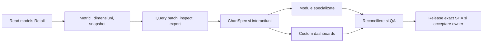

# Roadmap integrat UniHub Insight

Roadmapul urmărește un singur obiectiv persistent: transformarea aplicației live într-un cockpit managerial complet peste adevărul UniHub Retail. Nu este un calendar pe luni și nu declară drept module finalizate paginile care refolosesc șablonul generic.

Planul executabil și Definition of Done sunt în [Planul integrat](docs/PLAN_DEZVOLTARE_INTEGRAT.md). Acest fișier este registrul scurt de realitate și închidere.

## Realitate la baseline

| Zonă | Stare | Următorul rezultat necesar |
| --- | --- | --- |
| Runtime, deploy, Authentik, acces doar Andrei/Alexandra/Bogdan, DB read-only, monitoring | `LIVE` | păstrare și regresie continuă |
| Shell, filtre URL, Overview | `LIVE` | cross-filter/drill și semantică comună |
| Raport lunar și XLSX numeric | `LIVE` | integrare în catalogul comun de metrici/widgeturi |
| Sales, Performance, Campaigns, Workforce, Compensation, Finance, Planning | `PARȚIAL` | înlocuirea șablonului generic cu sub-view-uri și contracte proprii |
| Custom dashboards | `PARȚIAL` | query batch, editor complet, ACL per subject, preset/clone/share/versionare |
| ECharts 6.1 | `PARȚIAL` | `ChartSpec`, matrice întrebare→chart, interactions, renderer POC, accesibilitate și PNG |
| Reconciliere și QA | `PARȚIAL` | matrice completă date/roluri/browser și pilot vizual owner |

## Flux unic de livrare

Dependențele se implementează vertical: o suprafață ajunge `LIVE` numai când include contract de date, autorizare, UI specializat, inspect/export, reconciliere, browser QA, documentație și verificare live.

## Registru de workstream-uri

- [x] Read-model-uri canonice Retail v1 pentru Campaigns, Workforce, Compensation, Visits, Finance și Planning, publicate aditiv prin migrarea Retail 047.
- [x] Catalog versionat metrică/dimensiune/grain/comparison/capability și metadata de snapshot/generație per domeniu.
- [x] Query batch finit, snapshot fail-closed, deadline comun, izolare per widget, inspect și CSV server-side.
- [x] Lună/YTD/3–12 luni/an/interval, comparații multiple, URL state, drill și preseturi.
- [x] `ChartSpec` ECharts 6.1 Canvas, dataset/encode, evenimente URL, backing table, accesibilitate și PNG sigur; SVG rămâne respins până la motiv măsurat.
- [x] Sales, Performance, Campaigns, Workforce, Compensation, Finance și Planning au sub-view-uri și rețete distincte; contractele absente sunt afișate `UNAVAILABLE`, nu simulate.
- [x] Compensation folosește exclusiv agregatul aprobat, fără persoană/nume/filtre diferențiatoare.
- [x] Custom dashboards: blank/template/clone, duplicate, editor, layout/versionare, preseturi, ACL per subject, scope ceiling și batch execution.
- [x] XLSX/CSV/PNG, metric dictionary, audit/version history și autorizare comună.
- [x] Matrice negativă rol/capabilitate/export, reconciliere curent/închis, accessibility, backup/restore izolat, rollback compatibil, monitorizare și exact-SHA.
- [x] Browser QA pentru fluxurile critice, viewport/temă/densitate, URL drill/reload, inspector și export.
- [ ] Acceptare vizuală owner și șapte zile curate de SLI producție.

## Porți deschise după RC1

- Finance și Compensation sunt corect `UNAVAILABLE` în producție: tabelele de generații/head nu publică încă o generație eligibilă. Datele legacy nu sunt promovate implicit.
- Migrarea Retail 047 este aditivă pentru compatibilitatea N/N-1. Granturile raw Finance/Planning se revocă numai după două release-uri de produs acceptate și rollback B→A; drill-ul tehnic între artefacte RC1 nu autorizează încă revocarea.
- RC1 este publicat ca artefact immutable, reconciliat live, restaurat izolat și acoperit de rollback fail-closed. Release-urile pre-RC1 incompatibile sunt refuzate înainte de schimbarea symlinkului.
- Promovarea `1.0.0` mai cere acceptarea vizuală owner și șapte zile curate conform [Performance Acceptance](docs/PERFORMANCE_ACCEPTANCE.md).

## Reguli de execuție

- coordonatorul deține contractele comune, mutațiile live, deploy-ul și closure;
- Terra `xhigh` auditează/implementează selectiv DB, semantică, ACL, securitate, concurență, performanță și reconciliere;
- Luna `xhigh` prin terminal primește taskuri delimitate de UI/docs/chart mapping/test/browser QA;
- maximum trei taskuri independente în paralel, ownership exclusiv pe fișiere, fără full-suite-uri duplicate;
- local-first, puține candidate integrate, un deploy pentru candidatul stabil și evidence reuse.

## Definition of 1.0

Toate modulele sunt specializate și live; read-model-urile și metrica sunt autoritative; custom dashboards folosesc același query/inspect/export; drill/cross-filter/URL/preset/share funcționează; datele se reconciliază cu Retail; accesul sensibil și exporturile trec testele negative; browser QA și pilotul vizual owner sunt acceptate; șapte zile de performanță producție ating pragurile; exact SHA, monitorizare, backup/restore, rollback, documentație și Git sunt închise.
