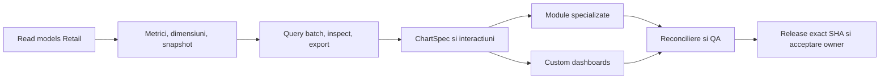

# Roadmap integrat UniHub Insight

Roadmapul urmărește un singur obiectiv persistent: transformarea aplicației live într-un cockpit managerial complet peste adevărul UniHub Retail. Nu este un calendar pe luni și nu declară drept module finalizate paginile care refolosesc șablonul generic.

Planul executabil și Definition of Done sunt în [Planul integrat](docs/PLAN_DEZVOLTARE_INTEGRAT.md). Acest fișier este registrul scurt de realitate și închidere.

## Realitate la baseline

| Zonă | Stare | Următorul rezultat necesar |
| --- | --- | --- |
| Runtime, deploy, Authentik, DB read-only, monitoring | `LIVE` | reconciliere allowlist exact owner + director general și vizibilitate completă identică |
| Shell, filtre URL, Overview | `LIVE` | light UniHub Retail implicit, sidebar light collapsible și scope firmă → RM multi → magazine multi → agenți multi; ASM numai drill intern |
| Raport lunar și XLSX numeric | `LIVE` | integrare în catalogul comun de metrici/widgeturi |
| Sales, Performance, Campaigns, Workforce, Compensation, Finance, Planning | `PARȚIAL` | înlocuirea șablonului generic cu sub-view-uri și contracte proprii |
| Custom dashboards | `RC1` | sharing/revocare layout cu cei doi utilizatori autorizați și acceptare owner |
| ECharts 6.1 | `PARȚIAL` | `ChartSpec`, matrice întrebare→chart, interactions, renderer POC, accesibilitate și PNG |
| Reconciliere și QA | `PARȚIAL` | matrice completă date/roluri/browser și pilot vizual owner |

## Flux unic de livrare

Dependențele se implementează vertical: o suprafață ajunge `LIVE` numai când include contract de date, autorizare, UI specializat, inspect/export, reconciliere, browser QA, documentație și verificare live.

## Registru de workstream-uri

- [x] Read-model-uri Retail sunt publicate aditiv; migrările 059–061 păstrează N-1 și adaugă snapshot v7, Compensation person/month v2 și Finance v2 peste aceleași rânduri acceptate de Retail. Head-ul/provenance îmbogățește datele, nu le ascunde, iar filtrul de perioadă P&L este măsurat la 0,10 s pentru 12 luni live.
- [ ] Catalogul și snapshotul sunt versionate; formulele au referințe versionate distincte, comparațiile native respectă allowlist-ul metricii, iar două dimensiuni sunt acceptate numai pentru heatmap-ul exact entitate × timp. Formele specializate încă lipsă rămân deschise.
- [x] Query batch finit, snapshot fail-closed, deadline comun, izolare per widget, inspect și CSV server-side.
- [x] Intervalele și URL state există; master scope-ul firmă→RM multi→magazin multi→agent multi se propagă în batch, module, dashboarduri, inspect/export și linkul Retail, iar ASM rămâne numai drill intern. Heatmap aplică simultan entitate+timp, iar dataZoom și controlul accesibil aplică un interval custom exact, cu breadcrumb/reset/reload și allowlist de comparații per metrică. Dublu-click sau `Shift+Enter` deschide distinct detaliul contextual read-only în Retail, fără mutarea URL-ului analizei.
- [ ] `ChartSpec` ECharts 6.1 Canvas are dataset/encode, fallback, PNG, keyboard QA și POC măsurat pentru 10 widgeturi/heatmap 100×36/scatter 5.000. Histograma și boxplot-ul folosesc aceeași implementare de quartile/outlieri, același eșantion și fallback explicit sub `n=5`. Calendarul zilnic observat este disponibil din contract Retail v1; forecast-band și formele fără dataset autoritativ rămân neofertate.
- [ ] Cele șapte module au sub-view-uri/rețete distincte și forme native Pace, Top/Bottom ranking, scatter, histogramă + boxplot cu statistici, waterfall fail-closed, forecast și calendar observat. Sales Transactions păstrează agregatele canonice și adaugă detailul bon/linie disponibil în Retail; Focus are scorecard, Top/Bottom observat și matrix; Planning Accuracy are KPI server-side, Actual × Forecast pe magazin și trend.
- [x] `1.0.0-rc.2` adaugă Sales Portfolio cu dimensiunile finite categorie, subcategorie, brand real și produs/SKU. Categoria/subcategoria vin din `reporting_category_month`; brandul este doar atribut din Monthly Review peste contabilitatea `reporting_item_month`, iar produsul este strict `item_code`. Reconcilierea network 2026-06 conservă în fiecare roll-up 3,223,513.13 RON și 33,279 unități nete, cu 6/20/19/1,099 entități; retururile rămân semnate și incidența SKU–bon nu este număr de bonuri distincte.
- [x] `1.0.0-rc.3` face starea fiecărui sub-view autoritativă server-side, separă Promo/Incentive/Folii/Concurs/Focus, consumă numai câmpurile canonice Concurs, expune Grile fenced și marchează People/Movements/Stability/Coverage drept activitate comercială observată, nu roster HR.
- [x] Corecție Compensation: persoane, valori salariale, ierarhie și provenance complete în KPI/detail/inspect/export; fără prag de cohortă, mascarea numelui sau condiția legacy `import_batch_id` care ascunde rândurile Retail. CNP rămâne în afara API-ului.
- [ ] Custom dashboards acoperă blank/template/clone/duplicate atomic/layout/versionare/ACL/batch, shared read-only, preseturi CRUD/apply, editor cu maximum două dimensiuni, opțiuni whitelist-uite și cross-filter semantic comun. ACL controlează layoutul, nu datele; browser QA acoperă sharing/revocare cu cei doi utilizatori autorizați.
- [ ] XLSX/CSV/PNG și audit există; widgeturile native/custom folosesc inspect/CSV/XLSX server-side pe același snapshot, exportul nativ refuză surse indisponibile/stale snapshot înainte de fetch, iar CSV/XLSX păstrează coverage, finalitate, as-of, generație și versiuni per sursă. Browser QA și reconcilierea tuturor modulelor cu surse oficiale rămân deschise.
- [ ] Reconcilierea live verifică Sales Portfolio, Visits v2, Campaigns v3, Concurs v1 și Grile v2 la grain-ul oficial. Promo POS păstrează `promo_qualifying_bons=NULL` când identitatea bonului nu există; unitățile nu sunt redenumite bonuri. Acceptarea globală 1.0 rămâne blocată de sursele încă nepublicate, cazurile edge, pilotul owner și poarta de performanță.
- [ ] Suita Playwright trece 58/58 pentru cele 10 rute, toate sub-view-urile declarate, filtrele multi-select exclusive, formele native, toggle-ul histogramă↔boxplot pe același eșantion, 1180/1440/1920/ultrawide, light/dark, densități, empty/partial/stale/unavailable/403, PNG/XLSX/CSV, drill/reload, selecție temporală, detaliu Retail distinct, comparații simultane, keyboard și dashboard lifecycle/POC; pilotul vizual owner rămâne poartă distinctă.
- [ ] Acceptare vizuală owner și șapte zile curate de SLI producție.

## Porți deschise pentru RC3 / 1.0

- [x] Finance și Compensation nu mai sunt `UNAVAILABLE` când Retail are date. Snapshot v7 și contractele v2 supersedează aditiv v1: Compensation păstrează persoanele/legacy, Finance păstrează actualele și estimările.
- `PARTIAL/UNAVAILABLE` trebuie să descrie coverage-ul real. Datele canonice Retail existente se afișează cu provenance `legacy/actual/estimated/draft`; numai lipsa reală de rânduri produce `UNAVAILABLE`.
- Migrarea Retail 047 rămâne imuabilă ca baseline N/N-1, dar contractele sale aggregate-only/actual-only nu mai reprezintă politica produsului. Reader-ul continuă least-privilege peste read-model-uri complete.
- Migrarea Retail 048 publică `reporting_sales_day_v1`; live 2026-08 reconciliază exact Sales lunar (`492.992,09` RON, `5.011` unități nete, `3.654` bonuri), expune `-52` unități retur și păstrează zilele absente drept missing. RUM-ul Web este inițializat, iar metricile/evaluatorul separă fail-closed exact SHA, suprafața și traficul real/sintetic; fereastra de șapte zile începe numai după deploy-ul acestei instrumentări și rămâne deschisă.
- Migrările Retail 049–050 publică aditiv `reporting_source_snapshot_v2` și `reporting_visit_month_v2`: 274/274 vizite eligibile din 2026-03…08 au autor Team Leader și magazin mapat; completion-ul istoric este recalculat din formular, fără UPDATE pe FieldOps; Performance/Workforce folosesc KPI, trend, breakdown și matrice dedicate, query/inspect/XLSX reutilizează aceeași felie, iar reconcilierea compară automat totalul, magazinele distincte, completion-ul și checklist-ul ponderat.
- Retail SHA `a5150341d4962a6f9592108adb7b74ec946bd964`, migrările 051–052, publică aditiv `reporting_source_snapshot_v3` și `reporting_planning_scenario_v2`. Head-ul rămâne marcajul variantei oficiale cu hash/row-count/CAS/ledger, dar candidații și scenariile existente trebuie să rămână vizibile cu statusul lor; `partial` descrie coverage/provenance, nu permisiune sau ecran gol.
- Retail migrarea 053 publică `reporting_source_snapshot_v4` și `reporting_campaign_month_v2`, cu generații immutable, head CAS, lineage de rollback, cantități nete semnate și coduri active sortate/deduplicate. Promo și Incentive nu mai sunt substituite cu Focus și nu mai sunt marcate `UNAVAILABLE` când head-ul eligibil există; finalitatea rămasă nedovedită produce `PARTIAL`, nu date inventate.
- Retail migrarea 057 păstrează v2/v4 și adaugă Campaigns v3, Concurs v1 și ancora Grile v1; migrarea 058 păstrează v5/v1 N-1 și adaugă `reporting_source_snapshot_v6` plus `reporting_grile_month_v2`. Concurs este publicat exclusiv prin `ContestsService`; Folii este numai varianta `same_model_screen_camera`; Grile alege atomic proiecția curentă fenced când există sau ultimul full run finalizat immutable, fără a combina rânduri între surse.
- Matricea live are diferențe numerice zero pentru 19/19 cazuri disponibile pe 2026-07 și 18/18 pe 2026-08, inclusiv magazin cu retur și, în iulie, agent cu target parțial. Nu este completă: lipsește magazinul transferat istoric în ambele luni și agentul cu target parțial în august; acceptarea autoritativă este 0 cât timp sursele cerute sunt `partial/unavailable`.
- RC1 este publicat ca artefact immutable, reconciliat live, restaurat izolat din copia NAS și acoperit de rollback real N→N-1→N cu schema forward-only. Release-urile incompatibile sunt refuzate înainte de schimbarea symlinkului.
- Promovarea `1.0.0` mai cere corectarea celorlalte statusuri `partial`, cazurile edge lipsă, acceptarea vizuală owner și șapte zile curate conform [Performance Acceptance](docs/PERFORMANCE_ACCEPTANCE.md).

## Restricții de date eliminate în contractul curent

| Restricție actuală | Efect | Corecție obligatorie |
| --- | --- | --- |
| grupuri/capabilități HR, P&L și management separate | 403 și module ascunse chiar pentru un utilizator al aplicației | rezolvat: orice subiect admis de Authentik folosește `insight:analytics` pentru toate modulele; capabilitățile legacy nu mai restrâng datele |
| Compensation v1 numai agregat, grain firmă/timp | fără persoane, magazine, ierarhie și componente în UI/inspect/export | read-model person-month v2 complet și aceleași dimensiuni în API/catalog/UI/export |
| `HAVING COUNT >= 3` și prag suplimentar Insight | ascunde cohorte și rânduri reale | eliminare totală a suprimării; orice medie alternativă rămâne metrică etichetată |
| salary batch `applied` + approval artifact + `person_id` obligatoriu | toate salariile legacy 2026 dispar, deși Retail le afișează | includerea tuturor rândurilor canonice Retail, cu provenance/mapping warnings vizibile |
| Finance v1 numai generation head `promoted` | `store_pnl_monthly` existent devine `UNAVAILABLE` | contract v2 peste aceeași sursă/preferință ca Retail |
| Finance v1 forțează `actual` | estimările mai–iunie 2026 dispar | păstrare `data_kind`; actual domină numai aceeași cheie, altfel estimarea rămâne vizibilă |
| snapshot `UNAVAILABLE` oprește query-ul înainte de citirea sursei | ecran gol din lipsă metadata, nu din lipsă date | availability derivată după verificarea rândurilor canonice |
| ACL/scope ceiling aplicate și datelor | dashboardul poate ascunde rânduri unui utilizator autorizat | ACL numai pentru layout/share/edit; vizibilitatea business rămâne completă |

Limitările de grain sau semantică nu devin permisiuni: Finance/Planning/Visits folosesc agent numai când există alocare sursă; `Cartele`, `TR %`, draft și `__FINANCE_UNALLOCATED__` pot rămâne în afara unui KPI definit, dar trebuie expuse în detail/inspect/export. Insight rămâne read-only, fără SQL/credentials în browser, iar `actual/estimated/legacy/draft`, missing și cutoff rămân explicite.

## Reguli de execuție

- coordonatorul deține contractele comune, mutațiile live, deploy-ul și closure;
- Terra `xhigh` auditează/implementează selectiv DB, semantică, ACL, securitate, concurență, performanță și reconciliere;
- Luna `xhigh` prin terminal primește taskuri delimitate de UI/docs/chart mapping/test/browser QA;
- maximum trei taskuri independente în paralel, ownership exclusiv pe fișiere, fără full-suite-uri duplicate;
- local-first, puține candidate integrate, un deploy pentru candidatul stabil și evidence reuse.

## Definition of 1.0

Toate modulele sunt specializate și live; read-model-urile și metrica sunt autoritative și complete; custom dashboards folosesc același query/inspect/export; drill/cross-filter/URL/preset/share funcționează; niciun rând Retail canonic nu este ascuns utilizatorilor allowlistați; accesul neautorizat trece testele negative; browser QA și pilotul vizual owner sunt acceptate; șapte zile de performanță producție ating pragurile; exact SHA, monitorizare, backup/restore, rollback, documentație și Git sunt închise.
