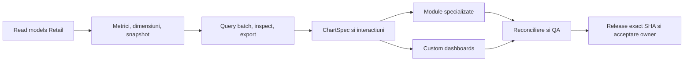

# Roadmap integrat UniHub Insight

Roadmapul urmărește un singur obiectiv persistent: transformarea aplicației live într-un cockpit managerial complet peste adevărul UniHub Retail. Nu este un calendar pe luni și nu declară drept module finalizate paginile care refolosesc șablonul generic.

Planul executabil și Definition of Done sunt în [Planul integrat](docs/PLAN_DEZVOLTARE_INTEGRAT.md). Acest fișier este registrul scurt de realitate și închidere.

## Realitate la baseline

| Zonă | Stare | Următorul rezultat necesar |
| --- | --- | --- |
| Runtime, deploy, Authentik, acces doar Andrei/Alexandra/Bogdan, DB read-only, monitoring | `LIVE` | păstrare și regresie continuă |
| Shell, filtre URL, Overview | `LIVE` | cross-filter/drill și semantică comună |
| Raport lunar și XLSX numeric | `LIVE` | integrare în catalogul comun de metrici/widgeturi |
| Sales, Performance, Campaigns, Workforce, Compensation, Finance, Planning | `PARȚIAL` | înlocuirea șablonului generic cu sub-view-uri și contracte proprii |
| Custom dashboards | `PARȚIAL` | query batch, editor complet, ACL per subject, preset/clone/share/versionare |
| ECharts 6.1 | `PARȚIAL` | `ChartSpec`, matrice întrebare→chart, interactions, renderer POC, accesibilitate și PNG |
| Reconciliere și QA | `PARȚIAL` | matrice completă date/roluri/browser și pilot vizual owner |

## Flux unic de livrare

Dependențele se implementează vertical: o suprafață ajunge `LIVE` numai când include contract de date, autorizare, UI specializat, inspect/export, reconciliere, browser QA, documentație și verificare live.

## Registru de workstream-uri

- [ ] Read-model-uri canonice Retail pentru Campaigns, Workforce, Compensation, Visits, Finance și Planning; fără formule copiate în Insight.
- [ ] Catalog versionat metrică/dimensiune/grain/comparison/capability și metadata de snapshot/generație proprie fiecărui domeniu.
- [ ] Contract finit de query cu batch planner, deadline comun și izolare per widget; aceeași valoare în modul, dashboard, inspect și export.
- [ ] Scope complet: lună/YTD/3–12 luni/an/interval, comparații multiple, URL state, drill-down, cross-filter, breadcrumb și preseturi.
- [ ] `ChartSpec` ECharts 6.1, chart matrix documentată, Canvas/SVG POC, ARIA/decals, backing table și export PNG sigur.
- [ ] Sales specializat: Pace, Trend, Mix, Drivers, Transactions și Calendar.
- [ ] Performance specializat: rețea→RM→ASM→magazin→agent, ranking, distribuție, heatmap, scatter, consistență, productivitate și visits.
- [ ] Campaigns specializat: Overview, Promo, Incentive, Concurs, Focus și Folii, cu coverage și fără cauzalitate inventată.
- [ ] Workforce specializat: People, Mișcări, Stabilitate, Acoperire, Productivitate, Vizite și Grile.
- [ ] Compensation specializat: numai read-model agregat aprobat, fără acces direct la `salary_records`/nume private și cu suprimare fail-closed.
- [ ] Finance specializat: actual/estimate, autoritate generație, cost structure, profitability, reconciliation, waterfall și break-even.
- [ ] Planning specializat: forecast 12 luni, accuracy, scenarii versionate și sensitivity.
- [ ] Custom dashboards: blank/template/clone, editor complet, layout/versionare DB, ACL per subject, partajare țintită și batch execution.
- [ ] XLSX/CSV/PNG, metric dictionary, audit/version history și aceeași autorizare ca API-ul.
- [ ] Matrice negativă rol/capabilitate/export; performanță, accessibility, backup/restore, rollback și exact-SHA.
- [ ] Browser QA toate modulele și view-urile, comparație cu Retail, viewport/temă/densitate și acceptare vizuală owner.

## Reguli de execuție

- coordonatorul deține contractele comune, mutațiile live, deploy-ul și closure;
- Terra `xhigh` auditează/implementează selectiv DB, semantică, ACL, securitate, concurență, performanță și reconciliere;
- Luna `xhigh` prin terminal primește taskuri delimitate de UI/docs/chart mapping/test/browser QA;
- maximum trei taskuri independente în paralel, ownership exclusiv pe fișiere, fără full-suite-uri duplicate;
- local-first, puține candidate integrate, un deploy pentru candidatul stabil și evidence reuse.

## Definition of 1.0

Toate modulele sunt specializate și live; read-model-urile și metrica sunt autoritative; custom dashboards folosesc același query/inspect/export; drill/cross-filter/URL/preset/share funcționează; datele se reconciliază cu Retail; accesul sensibil și exporturile trec testele negative; browser QA și pilotul vizual owner sunt acceptate; șapte zile de performanță producție ating pragurile; exact SHA, monitorizare, backup/restore, rollback, documentație și Git sunt închise.
