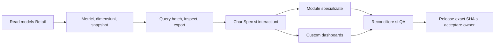

# Roadmap integrat UniHub Insight

Roadmapul urmărește un singur obiectiv persistent: transformarea aplicației live într-un cockpit managerial complet peste adevărul UniHub Retail. Nu este un calendar pe luni și nu declară drept module finalizate paginile care refolosesc șablonul generic.

Planul executabil și Definition of Done sunt în [Planul integrat](docs/PLAN_DEZVOLTARE_INTEGRAT.md). Acest fișier este registrul scurt de realitate și închidere.

## Realitate la baseline

| Zonă | Stare | Următorul rezultat necesar |
| --- | --- | --- |
| Runtime, deploy, Authentik, acces doar Andrei/Alexandra/Bogdan, DB read-only, monitoring | `LIVE` | păstrare și regresie continuă |
| Shell, filtre URL, Overview | `LIVE` | light UniHub Retail implicit, sidebar light collapsible și scope firmă → RM multi → magazine multi → agenți multi; ASM numai drill intern |
| Raport lunar și XLSX numeric | `LIVE` | integrare în catalogul comun de metrici/widgeturi |
| Sales, Performance, Campaigns, Workforce, Compensation, Finance, Planning | `PARȚIAL` | înlocuirea șablonului generic cu sub-view-uri și contracte proprii |
| Custom dashboards | `RC1` | matrice live sharing/revocare cu cei trei utilizatori reali și acceptare owner |
| ECharts 6.1 | `PARȚIAL` | `ChartSpec`, matrice întrebare→chart, interactions, renderer POC, accesibilitate și PNG |
| Reconciliere și QA | `PARȚIAL` | matrice completă date/roluri/browser și pilot vizual owner |

## Flux unic de livrare

Dependențele se implementează vertical: o suprafață ajunge `LIVE` numai când include contract de date, autorizare, UI specializat, inspect/export, reconciliere, browser QA, documentație și verificare live.

## Registru de workstream-uri

- [ ] Read-model-uri Retail sunt publicate aditiv; Sales Calendar folosește view-ul zilnic reconciliat, Visits folosește contractul v2 oficial pe autor Team Leader, Planning v2 publică numai forecasturi cu head CAS și Targeturi cu snapshot exact, iar Campaigns v2 publică Promo/Incentive immutable la agent × produs × magazin. Campaigns rămâne corect `partial` când head-ul legacy al vânzărilor nu dovedește finalitatea; Finance/Compensation și Planning live nu au încă head/generație eligibilă.
- [ ] Catalogul și snapshotul sunt versionate; formulele au referințe versionate distincte, comparațiile native respectă allowlist-ul metricii, iar două dimensiuni sunt acceptate numai pentru heatmap-ul exact entitate × timp. Formele specializate încă lipsă rămân deschise.
- [x] Query batch finit, snapshot fail-closed, deadline comun, izolare per widget, inspect și CSV server-side.
- [x] Intervalele și URL state există; master scope-ul firmă→RM multi→magazin multi→agent multi se propagă în batch, module, dashboarduri, inspect/export și linkul Retail, iar ASM rămâne numai drill intern. Heatmap aplică simultan entitate+timp, iar dataZoom și controlul accesibil aplică un interval custom exact, cu breadcrumb/reset/reload și allowlist de comparații per metrică. Dublu-click sau `Shift+Enter` deschide distinct detaliul contextual read-only în Retail, fără mutarea URL-ului analizei.
- [ ] `ChartSpec` ECharts 6.1 Canvas are dataset/encode, fallback, PNG, keyboard QA și POC măsurat pentru 10 widgeturi/heatmap 100×36/scatter 5.000. Histograma și boxplot-ul folosesc aceeași implementare de quartile/outlieri, același eșantion și fallback explicit sub `n=5`. Calendarul zilnic observat este disponibil din contract Retail v1; forecast-band și formele fără dataset autoritativ rămân neofertate.
- [ ] Cele șapte module au sub-view-uri/rețete distincte și forme native Pace, Top/Bottom ranking, scatter, histogramă + boxplot cu statistici, waterfall fail-closed, forecast și calendar observat. Sales Transactions este limitat la agregatele canonice; Focus are scorecard, Top/Bottom observat și matrix; Planning Accuracy are KPI server-side, Actual × Forecast pe magazin și trend. Contractele încă absente nu sunt înlocuite; specializarea completă rămâne deschisă pentru mecanismele/sursele nepublicate.
- [x] Compensation folosește exclusiv agregatul aprobat, fără persoană/nume/filtre diferențiatoare; cohortele de 1–2 sunt eliminate fail-closed din KPI, serie, breakdown, matrice și export.
- [ ] Custom dashboards acoperă blank/template/clone/duplicate atomic/layout/versionare/ACL/scope/batch, shared read-only, preseturi CRUD/apply, editor cu maximum două dimensiuni, opțiuni whitelist-uite și cross-filter semantic comun. Browser QA acoperă ciclurile interne; matricea live de sharing/revocare cu cei trei utilizatori reali rămâne poartă de acceptanță.
- [ ] XLSX/CSV/PNG și audit există; widgeturile native/custom folosesc inspect/CSV/XLSX server-side pe același snapshot, exportul nativ refuză surse indisponibile/stale snapshot înainte de fetch, iar CSV/XLSX păstrează coverage, finalitate, as-of, generație și versiuni per sursă. Browser QA și reconcilierea tuturor modulelor cu surse oficiale rămân deschise.
- [ ] Reconcilierea live verifică inclusiv Visits v2 ↔ felia Performance și Campaigns v2 ↔ evaluatorii Retail la grain-ul oficial. Promo și Incentive 2026-06 au diferență zero la rețea, Mobiup și MobiCell pentru vânzări, cantitate netă, discount/recompensă și participare. Numeric sunt zero diferențe și în 19/19 cazuri pe 2026-07 și 18/18 pe 2026-08, dar acceptarea globală 1.0 rămâne blocată de sursele încă nepublicate și cazurile edge declarate.
- [ ] Suita Playwright trece 58/58 pentru cele 10 rute, toate sub-view-urile declarate, filtrele multi-select exclusive, formele native, toggle-ul histogramă↔boxplot pe același eșantion, 1180/1440/1920/ultrawide, light/dark, densități, empty/partial/stale/unavailable/403, PNG/XLSX/CSV, drill/reload, selecție temporală, detaliu Retail distinct, comparații simultane, keyboard și dashboard lifecycle/POC; pilotul vizual owner rămâne poartă distinctă.
- [ ] Acceptare vizuală owner și șapte zile curate de SLI producție.

## Porți deschise după RC1

- Finance și Compensation sunt corect `UNAVAILABLE` în producție: tabelele de generații/head nu publică încă o generație eligibilă. Datele legacy nu sunt promovate implicit.
- Migrarea Retail 047 este aditivă pentru compatibilitatea N/N-1. Reader-ul Insight nu mai are granturi pe tabelele raw Finance/Planning; citește numai read-model-urile aprobate, iar preflight-ul blochează regresia.
- Migrarea Retail 048 publică `reporting_sales_day_v1`; live 2026-08 reconciliază exact Sales lunar (`492.992,09` RON, `5.011` unități nete, `3.654` bonuri), expune `-52` unități retur și păstrează zilele absente drept missing. RUM-ul Web este inițializat, iar metricile/evaluatorul separă fail-closed exact SHA, suprafața și traficul real/sintetic; fereastra de șapte zile începe numai după deploy-ul acestei instrumentări și rămâne deschisă.
- Migrările Retail 049–050 publică aditiv `reporting_source_snapshot_v2` și `reporting_visit_month_v2`: 274/274 vizite eligibile din 2026-03…08 au autor Team Leader și magazin mapat; completion-ul istoric este recalculat din formular, fără UPDATE pe FieldOps; Performance/Workforce folosesc KPI, trend, breakdown și matrice dedicate, query/inspect/XLSX reutilizează aceeași felie, iar reconcilierea compară automat totalul, magazinele distincte, completion-ul și checklist-ul ponderat.
- Retail SHA `a5150341d4962a6f9592108adb7b74ec946bd964`, migrările 051–052, publică aditiv `reporting_source_snapshot_v3` și `reporting_planning_scenario_v2`. `completed` nu mai este autoritate implicită: head-ul cere hash/row-count, approval artifact, revision CAS și ledger append-only; Targetul cere snapshot exact reconciliat cu registry-ul. 052 permite reader-ului numai digestul definer necesar verificării integrității, fără acces la tabelele forecast brute. Nicio migrare nu promovează date live, deci Planning rămâne corect `partial` până la aprobarea business separată.
- Retail migrarea 053 publică `reporting_source_snapshot_v4` și `reporting_campaign_month_v2`, cu generații immutable, head CAS, lineage de rollback, cantități nete semnate și coduri active sortate/deduplicate. Promo și Incentive nu mai sunt substituite cu Focus și nu mai sunt marcate `UNAVAILABLE` când head-ul eligibil există; finalitatea rămasă nedovedită produce `PARTIAL`, nu date inventate.
- Matricea live are diferențe numerice zero pentru 19/19 cazuri disponibile pe 2026-07 și 18/18 pe 2026-08, inclusiv magazin cu retur și, în iulie, agent cu target parțial. Nu este completă: lipsește magazinul transferat istoric în ambele luni și agentul cu target parțial în august; acceptarea autoritativă este 0 cât timp sursele cerute sunt `partial/unavailable`.
- RC1 este publicat ca artefact immutable, reconciliat live, restaurat izolat din copia NAS și acoperit de rollback real N→N-1→N cu schema forward-only. Release-urile incompatibile sunt refuzate înainte de schimbarea symlinkului.
- Promovarea `1.0.0` mai cere head-urile/generațiile Retail oficiale, cazurile edge lipsă, matricea reală Authentik, acceptarea vizuală owner și șapte zile curate conform [Performance Acceptance](docs/PERFORMANCE_ACCEPTANCE.md).

## Reguli de execuție

- coordonatorul deține contractele comune, mutațiile live, deploy-ul și closure;
- Terra `xhigh` auditează/implementează selectiv DB, semantică, ACL, securitate, concurență, performanță și reconciliere;
- Luna `xhigh` prin terminal primește taskuri delimitate de UI/docs/chart mapping/test/browser QA;
- maximum trei taskuri independente în paralel, ownership exclusiv pe fișiere, fără full-suite-uri duplicate;
- local-first, puține candidate integrate, un deploy pentru candidatul stabil și evidence reuse.

## Definition of 1.0

Toate modulele sunt specializate și live; read-model-urile și metrica sunt autoritative; custom dashboards folosesc același query/inspect/export; drill/cross-filter/URL/preset/share funcționează; datele se reconciliază cu Retail; accesul sensibil și exporturile trec testele negative; browser QA și pilotul vizual owner sunt acceptate; șapte zile de performanță producție ating pragurile; exact SHA, monitorizare, backup/restore, rollback, documentație și Git sunt închise.
