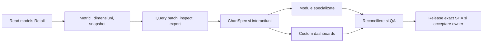

# Roadmap integrat UniHub Insight

Roadmapul urmărește un singur obiectiv persistent: transformarea aplicației live într-un cockpit managerial complet peste adevărul UniHub Retail. Nu este un calendar pe luni și nu declară drept module finalizate paginile care refolosesc șablonul generic.

Planul executabil și Definition of Done sunt în [Planul integrat](docs/PLAN_DEZVOLTARE_INTEGRAT.md). Acest fișier este registrul scurt de realitate și închidere.

## Realitate la baseline

| Zonă | Stare | Următorul rezultat necesar |
| --- | --- | --- |
| Runtime, deploy, Authentik, acces doar Andrei/Alexandra/Bogdan, DB read-only, monitoring | `LIVE` | păstrare și regresie continuă |
| Shell, filtre URL, Overview | `LIVE` | cross-filter/drill și semantică comună |
| Raport lunar și XLSX numeric | `LIVE` | integrare în catalogul comun de metrici/widgeturi |
| Sales, Performance, Campaigns, Workforce, Compensation, Finance, Planning | `PARȚIAL` | înlocuirea șablonului generic cu sub-view-uri și contracte proprii |
| Custom dashboards | `PARȚIAL` | query batch, editor complet, ACL per subject, preset/clone/share/versionare |
| ECharts 6.1 | `PARȚIAL` | `ChartSpec`, matrice întrebare→chart, interactions, renderer POC, accesibilitate și PNG |
| Reconciliere și QA | `PARȚIAL` | matrice completă date/roluri/browser și pilot vizual owner |

## Flux unic de livrare

Dependențele se implementează vertical: o suprafață ajunge `LIVE` numai când include contract de date, autorizare, UI specializat, inspect/export, reconciliere, browser QA, documentație și verificare live.

## Registru de workstream-uri

- [ ] Read-model-uri Retail v1 sunt publicate aditiv; Workforce/Visits/Campaigns rămân `partial`, iar Finance/Compensation nu au încă head eligibil.
- [ ] Catalogul și snapshotul sunt versionate; matricea metrică × dimensiune × chart este în curs de restrângere la combinații dovedite.
- [x] Query batch finit, snapshot fail-closed, deadline comun, izolare per widget, inspect și CSV server-side.
- [ ] Intervalele și URL state există; click-ul semantic acoperă timp și ierarhia firmă→RM→ASM→magazin→agent, cu breadcrumb/reset/reload și allowlist de comparații per metrică. Selecția unei zone temporale, deep-link-ul Retail și browser QA complet rămân deschise.
- [ ] `ChartSpec` ECharts 6.1 Canvas are dataset/encode, fallback, PNG, keyboard QA și POC măsurat pentru 10 widgeturi/heatmap 100×36/scatter 5.000. Calendarul/forecast-band și celelalte forme cer încă dataset autoritativ sau caz de business.
- [ ] Cele șapte module au sub-view-uri/rețete distincte, dar încă reutilizează componente generice și nu acoperă toate contractele specializate din plan.
- [x] Compensation folosește exclusiv agregatul aprobat, fără persoană/nume/filtre diferențiatoare.
- [ ] Custom dashboards acoperă blank/template/clone/duplicate/layout/versionare/ACL/scope/batch, shared read-only, preseturi, editor cu maximum două dimensiuni, opțiuni whitelist-uite și cross-filter semantic comun. Matricea live de sharing/revocare și browser QA complet rămân porți de acceptanță.
- [ ] XLSX/CSV/PNG și audit există; widgeturile native/custom folosesc inspect/CSV/XLSX server-side pe același snapshot și exportă întregul dataset deja bounded, cu metadata per sursă. Browser QA și reconcilierea tuturor modulelor cu surse oficiale rămân deschise.
- [ ] Reconcilierea live (30/30 scope-uri, diferențe zero), load/concurrency, backup-ul off-host restaurat izolat și rollback N→N-1→N trec pe candidatul publicat; matricea reală a celor trei sesiuni Authentik și RUM pe 7 zile rămân deschise.
- [ ] Suita Playwright trece 46/46 pentru cele 10 rute, toate sub-view-urile declarate, 1180/1440/1920/ultrawide, light/dark, densități, empty/partial/stale/unavailable/403, PNG/XLSX/CSV, drill/reload, comparații simultane, keyboard și dashboard lifecycle/POC; pilotul vizual owner rămâne poartă distinctă.
- [ ] Acceptare vizuală owner și șapte zile curate de SLI producție.

## Porți deschise după RC1

- Finance și Compensation sunt corect `UNAVAILABLE` în producție: tabelele de generații/head nu publică încă o generație eligibilă. Datele legacy nu sunt promovate implicit.
- Migrarea Retail 047 este aditivă pentru compatibilitatea N/N-1. Reader-ul Insight nu mai are granturi pe tabelele raw Finance/Planning; citește numai read-model-urile aprobate, iar preflight-ul blochează regresia.
- RC1 este publicat ca artefact immutable, reconciliat live, restaurat izolat din copia NAS și acoperit de rollback real N→N-1→N cu schema forward-only. Release-urile incompatibile sunt refuzate înainte de schimbarea symlinkului.
- Promovarea `1.0.0` mai cere acceptarea vizuală owner și șapte zile curate conform [Performance Acceptance](docs/PERFORMANCE_ACCEPTANCE.md).

## Reguli de execuție

- coordonatorul deține contractele comune, mutațiile live, deploy-ul și closure;
- Terra `xhigh` auditează/implementează selectiv DB, semantică, ACL, securitate, concurență, performanță și reconciliere;
- Luna `xhigh` prin terminal primește taskuri delimitate de UI/docs/chart mapping/test/browser QA;
- maximum trei taskuri independente în paralel, ownership exclusiv pe fișiere, fără full-suite-uri duplicate;
- local-first, puține candidate integrate, un deploy pentru candidatul stabil și evidence reuse.

## Definition of 1.0

Toate modulele sunt specializate și live; read-model-urile și metrica sunt autoritative; custom dashboards folosesc același query/inspect/export; drill/cross-filter/URL/preset/share funcționează; datele se reconciliază cu Retail; accesul sensibil și exporturile trec testele negative; browser QA și pilotul vizual owner sunt acceptate; șapte zile de performanță producție ating pragurile; exact SHA, monitorizare, backup/restore, rollback, documentație și Git sunt închise.
