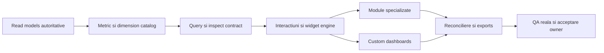

# Plan integrat de dezvoltare UniHub Insight

## Obiectiv unic

Transformarea aplicației live actuale într-un cockpit managerial desktop complet, conform viziunii inițiale: analiză multi-domeniu, istoric, comparații, drill-down, grafice moderne, dashboarduri configurabile, explicații și exporturi, peste adevărul operațional din UniHub Retail.

Viziunea funcțională de referință este [conversația inițială](https://chatgpt.com/share/6a738353-58f0-83ed-92a3-aaf2aa8488a8); realitatea implementării și contractele live au prioritate când conversația descrie ceva ca fiind deja gata, dar repository-ul sau producția arată că este parțial.

Acesta este un singur plan persistent. Nu este împărțit în luni, proiecte succesive sau handoff-uri artificiale. Ordinea menționată mai jos exprimă numai dependențe tehnice: un grafic nu poate fi declarat complet înaintea contractului metricii și a reconcilierii sursei sale.

## Stare candidat RC2

La 2026-08-06, Retail publică aditiv read-model-urile v1, Sales day v1, Visits v2 pe autor Team Leader, Planning v2 cu head de promovare CAS și Campaigns v2 cu generații immutable/head CAS pentru Promo și Incentive. Migrarea 052 expune reader-ului numai digestul definer necesar verificării, iar migrarea 053 publică numai agregatul de campanie aprobat, nu formule duplicate în Insight. Completion-ul Visits este recalculat din cele 19 câmpuri FieldOps. Candidatul Insight `1.0.0-rc.2` păstrează coloana vertebrală RC1 și adaugă Sales Portfolio reconciliat pe categorie, subcategorie, brand real și produs/SKU; nu rescrie `1.0.0-rc.1` cu alt conținut. Finance și Compensation rămân explicit `UNAVAILABLE`, iar Planning `partial`, până când Retail promovează generații/head-uri eligibile; datele legacy și run-urile doar `completed` nu sunt declarate oficiale. Închiderea `1.0.0` rămâne condiționată de matricea reală Authentik, acceptarea vizuală owner și șapte zile curate de performanță/RUM pe exact SHA-ul final.

## Adevărul de pornire

| Suprafață | Stare la baseline | Realitate |
| --- | --- | --- |
| Producție | LIVE | server principal, Caddy, Authentik, API pe UDS privat, PostgreSQL read-only, monitorizare și backup metadata |
| Acces | LIVE | acces la aplicație limitat la Andrei, Alexandra și Bogdan; capabilitățile de modul sunt verificate server-side |
| Shell și filtre | LIVE | desktop full-width, sidebar light collapsible, light implicit și filtre URL pentru perioadă/companie/RM multi/magazin multi/agent multi; ASM rămâne numai dimensiune internă |
| Overview | LIVE | KPI, evoluție zilnică, target/run-rate, contribuții, priorități și alerte |
| Raport lunar | LIVE | YoY, MoM, medie recentă 3/6/12 luni, companii/RM/magazine/agenți/produse/retururi și XLSX numeric |
| Sales, Performance, Campaigns, Workforce, Compensation, Finance, Planning | PARȚIAL | date live și câte o pagină, dar predominant același șablon generic cu 4 KPI, trend, distribuție, matrice și tabel |
| Custom Dashboards | RC1 | CRUD/preset/clone/duplicate/layout/versionare/ACL/scope/batch sunt implementate; lipsește matricea live sharing/revocare cu cele trei sesiuni reale |
| Inspect/export | RC1 | query/inspect/CSV/XLSX server-side unificat pe widgeturi native/custom și PNG sigur; lipsește reconcilierea tuturor surselor oficiale și acceptarea externă |
| Interacțiuni analitice | RC1 | fullscreen/focus trap, keyboard drill/reset, breadcrumb/reload, click semantic pe timp și ierarhia completă, selecție temporală dataZoom/control accesibil, comparații simultane allowlist-uite și deep-link contextual consumat de Retail |
| Identitate versiune | PARȚIAL | UI indică `v0.5`, în timp ce metadatele pachetelor/API au versiuni mai vechi; versiunea produsului trebuie unificată |

O rută care se încarcă sau un canvas care desenează un grafic nu înseamnă că modulul de business este complet.

## Research asupra datelor disponibile

Inventarul a fost verificat read-only în PostgreSQL live la 2026-08-05 (Europe/Bucharest) și în contractele Retail la SHA-ul din front matter. Numerele sunt snapshot de acoperire, nu KPI de business.

| Domeniu | Acoperire disponibilă | Decizie pentru plan |
| --- | --- | --- |
| Vânzări și performanță | `reporting_agent_month`, `reporting_category_month` și `reporting_item_month`, 2023-09…2026-08; zi/lună, categorie/subcategorie, brand real, produs/SKU, bonuri și retururi | Sales Portfolio păstrează categoria/subcategoria din read-modelul de categorie; `insight.monthly_review_item_month` adaugă numai atributele brand/categorie peste item, fără a deveni sursă contabilă |
| Agenți | profile și lifecycle 2023-09…2026-08; targeturi pe agent și magazin | analiză longitudinală numai cu identitate stabilă; legăturile lipsă rămân explicit neasociate |
| Campanii | Focus în reporting; Promo și Incentive publicate prin `reporting_campaign_month_v2`; Concurs și Folii fără head oficial eligibil | Insight citește exclusiv mecanismele publicate și păstrează Concurs/Folii unavailable până la un contract Retail oficial; Concurs are două mecanisme Retail în 2026-06, dar `promo_bonuri` însumează unități excluse, nu bonuri distincte, deci nu poate deveni metrică Insight |
| Workforce și Grile | lifecycle, profil agent, `grile_store_current_status`; 274 vizite FieldOps în intervalul 2026-03-19…2026-08-05 la snapshot | Visits v2 este publicat pe autor Team Leader și îmbogățire curentă de magazin; mișcările, rosterul și Grile analitice complete rămân contracte separate |
| Compensații | 3.716 înregistrări lunare 2025-01…2026-06 la snapshot și legături agent-persoană | componentele salariale se expun numai prin view-uri agregate dedicate; CNP și identitatea privată nu intră în Insight; pragul de minimum 3 persoane rămâne fail-closed |
| Finance/P&L | `store_pnl_monthly`, 2017-01…2026-06 la snapshot; tabelele noii autorități de generații nu au încă head live | fiecare valoare trebuie să arate `actual/estimate`, autoritatea, reconcilierea și coverage; Insight nu tratează shadow/generații nepromovate drept actuale |
| Planning | forecast lunar 2026-07…2027-07 și scenarii Target 2026-06…2026-08 la snapshot | v2 publică numai run-uri prin head aprobat și Targeturi cu snapshot exact; Insight compară versiuni, nu promovează/mută/finalizează date |

### Read-model-uri Retail necesare

Noile suprafețe trebuie să fie Retail-owned, versionate și acordate explicit rolului read-only Insight:

- `reporting_campaign_month_v2`: mecanism, campanie, perioadă/cutoff, firmă/RM/magazin/agent/produs, vânzări, cantitate netă semnată, discount/recompensă, eligibilitate, coduri active și statut `official/partial/unavailable`;
- `reporting_workforce_month`: persoană opacă, rol, intrare/ieșire/transfer, vechime, zile lucrate, magazine acoperite și legătura de reporting;
- `reporting_compensation_month`: numai agregate și componente aprobate, fără CNP sau identificatori privați;
- `reporting_visit_month_v2`: vizite și indicatori agregați la lună × Team Leader autor × magazin; v1 pe ASM rămâne numai rollback N-1;
- `reporting_finance_month`: actual/estimate, category contract, coverage, reconciliation și generation authority;
- `reporting_planning_scenario`: scenariu/rule-set/snapshot/forecast/target, versiune și status, fără drept de scriere.

Acestea sunt contracte de publicat, nu obiecte presupuse existente. Fiecare trebuie să includă grain, chei stabile, coverage numărător/numitor, cutoff, `source_generation`, authority/head, rule-set/version, status și politica missing/partial/stale. View-urile pot avea alte nume finale dacă Retail are deja un contract echivalent. Criteriul este o singură semantică autoritativă, nu numele obiectului.

Reguli de domeniu care nu pot fi pierdute în agregare:

- Sales Portfolio acceptă exact o dimensiune dintre categorie, subcategorie, brand și produs. `item_code` este identitatea produsului; retururile rămân semnate, iar `receipt_count` la produs este incidență SKU–bon, nu bon distinct. Brandul este atribut real din Monthly Review peste `reporting_item_month`, nu o nouă sursă de vânzări. În network 2026-06, toate cele patru roll-up-uri conservă 3,223,513.13 RON și 33,279 unități nete (6 categorii, 20 perechi, 19 branduri, 1,099 SKU).
- Campaigns păstrează separat Promo/Incentive/Concurs/Focus/Folii, cutoff-ul POS, stările `complete/partial/invalid`, excluderile Promo din Incentive și politica de identitate Concurs; mecanismele nu se însumează arbitrar;
- Workforce folosește identitate stabilă effective-dated și evenimente oficiale; intrările/ieșirile nu se deduc din lipsa vânzărilor, iar vizitele păstrează snapshotul Team Leader;
- Compensation elimină și revocă accesul Insight direct la `salary_records`, `agent_salary_links` și `full_name`; read-model-ul final este exclusiv agregat, fără persoane, iar filtrele/inspect/export nu permit diferențierea unei persoane. Totalul folosește toate rândurile, media numai valorile ≥2.000 RON, mediana toate valorile, iar cohortele de 1–2 persoane nu produc KPI, serie sau export;
- Finance selectează explicit `actual` versus `estimated` la cheia companie–lună–magazin canonic; `__FINANCE_UNALLOCATED__` intră în totalul companiei, niciodată în magazin/RM, iar shadow/nepromovat nu devine oficial;
- Planning fixează pentru forecast `run_id`, horizon, model/method, input cutoff și coverage; numai head-ul cu hash/row-count, approval artifact, revision CAS și ledger este eligibil. Pentru Target fixează `scenario_id`, revizie, status, rule-set hash și snapshot exact reconciliat cu registry-ul; drafturile și legacy-unversioned nu devin implicit analiză partajată.

Părțile `unavailable/partial` din Workforce, Compensation, Finance și Planning
arată lipsa contractului agregat aprobat, a publicării read-model-ului sau a
head-ului/generației eligibile pentru Insight; nu afirmă inexistența tuturor
datelor Retail subiacente.

## Experiența finală

| Modul | Suprafețe obligatorii |
| --- | --- |
| Overview | health în 10 secunde, target/forecast/comparații, profit și cost salarial unde există acces, creșteri/scăderi, risc, alerte de date, abateri și explicații evidence-backed |
| Raport lunar | analiza actuală păstrată și reutilizabilă ca preset; comparații YoY/MoM/3–12 luni, sezonalitate, management performance și export complet |
| Sales | Pace, Trend, Mix, Drivers, Transactions și Calendar; MTD/YTD/interval, categorie/subcategorie/brand/produs, bonuri, 2+, medie bon, retururi și heatmap zi/săptămână/lună |
| Performance | Rețea → RM → ASM → magazin → agent, rankings, distribuții, target matrix, heatmap, scatter, consistență, volatilitate, productivitate și vizite |
| Campaigns | Overview, Promo, Incentive, Concurs, Focus și Folii; target/actual, coverage, adopție, discount, contribuție, top/bottom și participation gaps, fără afirmații cauzale neverificate |
| Workforce | People, Mișcări, Stabilitate, Acoperire, Productivitate, Vizite și Grile; intrări, ieșiri, transferuri, vechime și zile lucrate |
| Compensation | structură fix/variabil/bonuri unde contractul permite, medie/mediană/distribuție, payroll/sales, payroll/profit și performanță versus remunerație, cu suprimare strictă |
| Finance | Overview, Trend, Cost structure, Profitability, Reconciliation și Break-even; venit, cost, EBIT/profit, marjă, actual/estimate, waterfall și magazin/companie |
| Planning | Current, 12 luni, Accuracy, Scenarios și Sensitivity; target gap, bază/upside/downside, staffing, salariu, TVA și marjă, peste snapshoturi versionate |
| Custom | dashboard blank/template/clone, editor complet de widget, layout DB, preseturi, partajare țintită, fullscreen, inspect, duplicate și export |

## Coloana vertebrală de dependențe

Aceasta este ordine tehnică, nu fazare calendaristică:

## Workstream-uri integrate

Toate workstream-urile aparțin aceluiași obiectiv și se închid împreună.

### Research ECharts 6.1 și matricea de selecție

Standardul vizual rămâne Apache ECharts 6.1, importat modular. Alegerea graficului pornește de la întrebarea de business și forma datelor, nu de la efectul vizual. Deciziile se bazează pe documentația oficială pentru [tipuri și capabilități](https://echarts.apache.org/en/feature.html), [noutățile ECharts 6](https://echarts.apache.org/handbook/en/basics/release-note/v6-feature/), [dataset/encode](https://echarts.apache.org/handbook/en/concepts/dataset/), [transformări](https://echarts.apache.org/handbook/en/concepts/data-transform/), [events/actions](https://echarts.apache.org/handbook/en/concepts/event/), [Canvas versus SVG](https://echarts.apache.org/handbook/en/best-practices/canvas-vs-svg/), [ARIA](https://echarts.apache.org/handbook/en/best-practices/aria/) și [securitate](https://echarts.apache.org/handbook/en/best-practices/security/).

| Întrebare / structură | Vizualizare implicită | Alternative controlate | Reguli |
| --- | --- | --- | --- |
| Stare față de țintă | KPI + progress/bullet bar | variance bar | fără gauge dacă aceeași informație încape mai clar într-o bară |
| Trend în timp | line | column pentru perioade discrete; area numai pentru volum/cumul; combo actual/target/forecast | `dataZoom` pentru serii lungi; fără smoothing care sugerează valori inexistente |
| Ranking/comparație | bar orizontal | lollipop custom + tabel | sortare vizibilă, top/bottom explicit; maximum 30 categorii vizibile, apoi Top N + tabel |
| Parte din întreg | stacked / 100% stacked bar | donut doar la maximum 5–6 categorii; treemap pentru ierarhii dense | fără pie cu multe felii; categoria `Altele` rămâne inspectabilă |
| Factori ai schimbării | waterfall | variance bars | începutul, sfârșitul și subtotalurile trebuie să se reconcilieze |
| Relația dintre două metrici | scatter | bubble pentru exact o a treia măsură; jitter/beeswarm când punctele se suprapun | tooltip și backing table obligatorii; nu se afirmă cauzalitate |
| Distribuție | histogramă + boxplot | violin numai cu eșantion suficient și metodologie explicată | arată `n`, mediană, quartile și outliers; fără cohorte sensibile sub prag |
| Entitate × perioadă | heatmap Canvas | matrix coordinate ECharts 6 pentru small multiples/cohorte | limită inițială 100 rânduri × 36 perioade, apoi agregare/paging; legendă, contrast și tabel |
| Ierarhie | bar drillable | treemap; sunburst numai când traseul ierarhic este întrebarea centrală | precizia comparației are prioritate față de decor |
| Flux/relații | Sankey/chord | — | numai pentru fluxuri sau relații reale, nu pentru organigramă obișnuită |
| Forecast și incertitudine | interval/fan band custom + linii scenariu | range bar | intervalele și scenariile sunt etichetate; nu se confundă forecast cu actual |
| Calendar operațional | calendar heatmap | bar pe zi/săptămână | cutoff și zile fără acoperire distincte de zero |

Vizualizările 3D, rose/Nightingale, funnel fără etape reale, axe duble ambigue și broken axis fără marcaj explicit nu intră în catalogul implicit. Broken axis din ECharts 6 poate fi folosit numai justificat, documentat și acceptat vizual de owner.

Stare tehnică RC1: adaptorul Canvas înregistrează modular Line, Bar, Pie/Donut, Scatter, Heatmap, Boxplot, Treemap și Calendar; Area, histogram, waterfall reconciliat și forecast band sunt compoziții controlate în `ChartSpec`. Orice formă fără dimensiunile semantice cerute revine la tabel, iar waterfall-ul este refuzat dacă start + delta nu reconciliază totalul. Calendarul Sales este oferit numai peste `reporting_sales_day_v1`: rândurile sunt zile observate, lipsa nu devine zero, iar returul este cantitate negativă. Transactions folosește exclusiv cele trei agregate canonice de bon; Performance și Focus afișează Top/Bottom explicit; distribuția comută histogramă ↔ boxplot peste același eșantion, publică `n`, mediană, quartile și outlieri IQR și refuză boxplot-ul sub `n=5`; Planning Accuracy folosește perechile server-side Actual × Forecast pe magazin. Funnel, Sankey/Chord, Brush, SVG și violin rămân `NEIMPLEMENTAT` până la un caz de business și un POC măsurat; forecast band nu este oferit fără intervale autoritative.

Înaintea extinderii selectorului se închide un ADR cu matricea întrebare → chart → alternativă tabelară → cardinalitate → interacțiune → accesibilitate → performanță și prototipuri pe date reale redactate. Motorul vizual va avea un `ChartSpec` registry central care mapează formă analitică → tipuri permise, cerințe de date, renderer, formatter, interacțiuni și export. `dataset` cu `dimensions`/`encode` devine limita comună de date pentru chart-uri. Transformările client rămân presentation-safe — sort, filter, boxplot — iar formulele KPI și agregările autoritative rămân server-side. Events/actions trec printr-un adapter de cross-filter care actualizează starea URL, nu prin stare globală mutată direct de chart.

Rendererul implicit rămâne Canvas pentru graficele mari. SVG se acceptă numai după POC pentru dashboarduri cu multe instanțe mici sau cerințe de zoom/vector; decizia se face pe memorie, frame time și stabilitate, nu prin preferință. ARIA, decals/non-color encoding, navigare din tastatură la controale și tabelul sursă sunt obligatorii. Opțiunile, linkurile și numele `saveAsImage` nu acceptă input nesanitizat.

`connectNulls` este `false` implicit: lipsa, zilele viitoare și coverage incomplet nu sunt unite vizual. Pentru scene mari animația se reduce/oprește, iar orice opțiune venită din dashboard este whitelist-uită; nu se acceptă formatter HTML, URL, regex sau funcție arbitrară.

**POC-uri și stare:** browser QA reproductibil acoperă cele 10 rute, formele native, toggle-ul histogramă↔boxplot, 1180/1440/1920/ultrawide, light/dark, Compact/Comfortable, inspector, preset CRUD/apply, ACL UI, URL drill/reload/reset, selecție temporală, deschiderea distinctă a detaliului Retail și 403; trendurile lungi activează zoom, iar bundle-ul are buget verificat. POC-ul Canvas din 2026-08-06 așteaptă evenimentul ECharts `finished` și trece pe 10 widgeturi, heatmap 100×36, scatter 5.000 puncte, first render 5.753,5 ms, resize blocking p95 33,5 ms și heap post-GC -2.075.992 bytes după trei remount-uri, sub pragul de 64 MiB. SVG rămâne neautorizat fără un caz de business distinct. PNG rămâne non-persistent și cu pixel ratio controlat. Poarta rămâne interacțiune p95 sub 200 ms.

### Contract analitic comun

- resolver de `analytical_snapshot_id` înaintea catalogului: toate widgeturile unui dashboard citesc aceeași generație/cutoff eligibilă `completed/promoted`, cu compatibilitate Consumer N/N-1 între release-urile Retail și Insight;
- metadata este per domeniu/sursă; cutoff-ul Sales nu este reutilizat pentru Finance, HR sau Forecast, iar răspunsul dashboardului expune snapshotul comun și warnings pe fiecare sursă;
- catalog versionat pentru metrici, dimensiuni, grain-uri, comparații, formule, unități, missing policy, capabilități și effective dates;
- contract finit de query pentru `metrics`, `dimensions`, `time_range`, `time_grain`, `filters`, `comparisons`, `sort` și `limit`, plus query batch server-side cu deduplicare, maximum 8–12 widgeturi, deadline/anulare comune și rezultat/eroare izolate per widget;
- validare server-side a combinațiilor metrică × dimensiune × grain × vizualizare;
- răspuns comun cu perioadă, scope, cutoff și finalitate per sursă, coverage numărător/numitor, authority/head, source generation, metric/rule version, generated time și warnings;
- endpoint server-side de inspect care returnează exact rândurile agregate din același snapshot/query al widgetului, nu o reconstrucție din payloadul UI;
- specializările de domeniu rămân servicii/repository distincte; nu se construiește SQL arbitrar sau un endpoint generic necontrolat.

**Acceptanță:** aceeași metrică dă aceeași valoare în modul, dashboard, inspector și export; un dashboard nu amestecă generații; un widget lent/defect nu prăbușește celelalte; o definiție schimbată nu rescrie tăcut sensul dashboardurilor salvate.

### Scope, istoric și interacțiuni

- perioadă ca lună, YTD, ultimele 3/6/12 luni, an și interval personalizat;
- comparații simultane cu target, forecast, perioadă precedentă, anul trecut și medie recentă unde contractul permite;
- URL-ul păstrează modul/dashboardul, scope-ul, perioada, comparațiile și drill path;
- tranziția de la o lună + o comparație la intervale + comparații simultane are contract de compatibilitate pentru URL-uri și dashboarduri salvate;
- click pe entitate aplică cross-filter widgeturilor compatibile; breadcrumb revine fără pierderea contextului;
- double-click/deschidere detaliu pentru magazin/agent și deep-link contextual read-only către Retail;
- selecția unei zone temporale din grafic aplică intervalul;
- preseturi de filtre personale și partajate;
- store selection continuă să domine compania/RM/ASM în istoricul unde contractul Retail o cere;
- identitatea longitudinală folosește entity IDs effective-dated, nu numele agentului; `site_code` rămâne cheia operațională dominantă.

**Acceptanță:** navigarea Rețea → RM → ASM → magazin → agent conservă totalurile; refresh/copy URL reproduce exact analiza.

### Motor vizual și widgeturi

- tipurile și combinațiile vin exclusiv din matricea ECharts/`ChartSpec`: KPI, progress, line, area, column, stacked, combo, waterfall, scatter, bubble, heatmap, treemap, donut limitat, histogramă, box plot, ranking, table/pivot, alerts și forecast range;
- numai transformări compatibile; selectorul nu oferă combinații fără sens;
- densitate Compact/Comfortable, teme light/dark, legendă/labels/target configurabile;
- Chart Studio global păstrează preseturi Executive/Ocean/Vibrant/Accessible/Monochrome, densitate, legendă, etichete, smoothing/animații controlate și reset; preferințele nu pot încălca `ChartSpec`, missing policy sau accesibilitatea;
- fullscreen, inspect, duplicate, export și explicația metricii pe fiecare widget;
- cardurile expun explicit override-urile, cutoff-ul, coverage-ul și starea datelor;
- grid de 24 coloane, fără max-width și fără spații moarte; layoutul este versionat și migrabil.

**Acceptanță:** fiecare vizualizare are tabel sursă, semantică accesibilă și funcționează la dimensiunea minimă documentată.

### Module de domeniu

Fiecare modul înlocuiește șablonul generic cu sub-view-uri și widgeturi proprii din tabelul „Experiența finală”. Implementarea unui modul include în aceeași schimbare coerentă:

1. read-model și metrici;
2. API și contracte;
3. UI specializat și interacțiuni;
4. inspector și export;
5. reconciliere Retail pe network/company/RM/ASM/store/agent unde se aplică;
6. teste de permisiuni, missing/partial/stale și browser;
7. documentație și acceptare vizuală.

Nu se mai creează pagini placeholder și nu se marchează un modul complet pentru că răspunsul generic conține patru KPI.

### Custom Dashboards și metadata

- editorul expune metrică/metrici, dimensiune, grain, comparații, vizualizare, filtre locale, sort, limit, titlu, legendă, labels și opțiuni;
- blank, template, clone, duplicate widget, reorder, resize, reset și migrare layout;
- dashboardul selectat și versiunea sunt adresabile în URL;
- metadata DB adaugă versiuni/audit actor+timp, filter presets, `dashboard_acl(dashboard_id, subject, permission)`, owner/admin/revocare și un director minimal al utilizatorilor Insight autorizați;
- `private`, `shared read-only` și permisiune explicită per subject; verificarea capability + scope ceiling se repetă la citire, query, inspect și export, iar niciun share nu extinde capabilitatea de date a destinatarului;
- widgetul persistă `metric_id`, `metric_version` și `query_contract_version`, nu sensul implicit al payloadului generic de modul;
- preview-ul execută batch planner-ul comun; eroarea unui widget este izolată și nu golește întregul dashboard;
- widgeturile custom folosesc același contract de query/inspect/export ca modulele native.

**Acceptanță:** un dashboard Director/RM/Finance/Risk poate fi recreat integral din editor, distribuit unuia dintre utilizatorii autorizați și restaurat după upgrade fără schimbarea sensului metricilor.

### Export, explicație și istoric

- XLSX server-side cu tipuri numerice native pentru orice suprafață relevantă;
- CSV pentru backing tables și PNG non-persistent pentru grafice/widget/dashboard; toate au bounds/paging, deadline/anulare, audit, protecție Excel formula injection și nume de fișier sanitizat;
- exporturile conțin metadata, scope, cutoff, source, versiunea metricilor și warnings;
- dicționar de metrici accesibil din UI: definiție, formulă, unitate, missing policy și sursă;
- explicații generate automat numai din metrici/versionări/scope/cutoff verificabile: ce s-a schimbat, unde, contribuțiile principale și ce dată lipsește; fiecare propoziție are backing evidence, iar sistemul nu inventează cauzalitate sau recomandări operaționale nesusținute;
- alerte și detectarea abaterilor pornesc din reguli/benchmarkuri versionate și afișează pragul, populația, perioada și motivul; metode statistice se adaugă numai cu evaluare și false-positive gate;
- istoric pentru luni, forecast run-uri, scenarii Target și versiuni dashboard, fără copiere inutilă a rezultatelor Retail;
- exporturile sensibile aplică aceeași autorizare și suprimare ca API-ul.

**Acceptanță:** totalurile din UI, inspector, XLSX și Retail sunt identice; numerele rămân numere în Excel.

### Securitate, performanță și operabilitate

- accesul exterior rămâne Authentik și grupul de aplicație cu exact cei trei utilizatori autorizați; drepturile Analytics/Management/HR/P&L/Admin rămân separate;
- E2E de identitate folosește forma reală Authentik, inclusiv grupuri separate cu pipe, nu doar identitate injectată convenabil;
- browserul nu primește DB credentials, SQL, CNP sau surse salariale private;
- rolurile DB păstrează granturi explicite numai pe read-model-urile aprobate;
- p95: Overview sub 1 s, module ordinare sub 2 s, interacțiuni sub 200 ms; hard timeout și exporturile rămân bounded;
- se măsoară înainte de index/materializare/cache; nu se introduce ClickHouse sau alt datastore fără bottleneck demonstrat;
- Prometheus/RUM etichetează finite exact SHA, suprafața și traficul `real/synthetic/system`; evaluatorul refuză verdictul înainte de șapte zile continue, 100 cereri reale pe suprafață și RUM real eligibil. Alertele, backup/restore metadata, immutable release, rollback și exact-SHA rămân porți de release;
- identitatea versiunii se unifică în package, API, UI și `build-info.json`.

**Acceptanță:** matricea reală de roluri, public boundary, performanța, backup/restore și rollback trec pe exact același SHA.

## Strategie de testare și reconciliere

- contract tests pentru fiecare metrică, dimensiune, comparație și missing policy;
- fixtures live read-only pe două luni închise și luna curentă, pentru network/company/RM/ASM/store/agent;
- conservation tests la drill-down și comparații istorice;
- capability matrix cu apel direct la endpoint și export, nu doar element ascuns în UI;
- browser E2E în Chrome pentru toate modulele, sub-view-urile, filtrele, chart toggles, inspect, fullscreen, cross-filter, dashboards și downloaduri;
- verificare vizuală pe 1180, 1440, 1920 și ultrawide, light/dark, Compact/Comfortable;
- testarea scenariilor empty/partial/stale/unauthorized și a lunilor fără sursă;
- reconciliere la cent pentru Finance; la unitate pentru Sales Portfolio (inclusiv cardinalitatea 4 dimensiuni, retur semnat și incidență SKU–bon), la unitate/bon pentru Sales/Campaigns și ponderat la grain lună × Team Leader × magazin pentru total/completion/checklist Visits v2;
- load test pe dashboarduri mixte cu 8–12 widgeturi și export concurent;
- owner visual pilot pe Overview și câte un template dens de modul înainte de propagarea layoutului.

## Politica de execuție

- planul rămâne un singur goal activ până la Definition of Done;
- schimbările se grupează în puține candidate integrate, fiecare cu data contract + produs + verificare, nu în zeci de livrări ceremoniale;
- dezvoltarea și testele sunt local-first pe Dell; GitHub Actions nu este runner iterativ;
- modulele independente pot avansa în paralel numai după înghețarea contractelor comune;
- un singur deploy per candidat stabil, urmat de verificare live și reconciliere;
- documentația și statusurile `LIVE/PARȚIAL/NEIMPLEMENTAT` se actualizează odată cu codul;
- niciun handoff nu declară „gata” fără owner-facing visual evidence pentru suprafețele schimbate.

### Orchestrare agenți și eficiență de cost

| Rol | Utilizare preferată | Responsabilitate |
| --- | --- | --- |
| Agent coordonator | integrare și decizii comune | arhitectură, interfețe comune, împărțirea ownershipului, rezolvarea conflictelor, mutații/deploy și verdict final |
| Terra `xhigh` | risc ridicat, folosit selectiv | DB/read-model-uri, semantică metrici, migrații, ACL/RBAC, concurență, securitate, performanță și reconciliere Retail |
| Luna `xhigh`, lansată prin terminal | taskuri ample dar bine delimitate și mai ieftine | inventar mecanic, implementări UI/docs izolate, mapare chart-uri, teste țintite, browser QA și audit vizual |

- maximum trei subagenți independenți simultan; nu se paralelizează fișiere comune sau aceeași decizie;
- agenții pornesc read-only; primesc drept de editare numai pe fișiere/suprafețe cu ownership exclusiv și predau lista exactă de modificări, comenzi, dovezi și riscuri;
- contractele comune, deploy-ul, operațiile live și închiderea Git rămân la coordonator;
- taskurile mici sau puternic cuplate rămân la coordonator, fiindcă handoff-ul ar costa mai mult decât execuția;
- Luna acoperă în mod implicit work voluminos/repetabil; Terra este rezervată domeniilor unde o eroare de date, autorizare ori concurență ar costa mult;
- nu se dublează full-suite-uri: agenții rulează gate-uri țintite, iar coordonatorul rulează o singură verificare integrată pe candidatul neschimbat și reutilizează dovezile valide;
- browser QA se împarte pe module și roluri, apoi coordonatorul repetă fluxurile P0/P1 și reconcilierea înainte de release.

## Non-goals și limite

- nu se construiește un Power BI generic, SQL arbitrar sau editor liber de formule;
- Insight nu scrie importuri, salarii, targeturi, campanii, P&L sau scenarii în Retail;
- nu se inventează granularitate zilnică pentru actuale Promo/Incentive cumulative la cutoff;
- nu se numește „impact incremental” o diferență fără metodologie de baseline validată;
- nu se expun cohortele salariale sub prag, identități private sau CNP;
- nu se tratează datele shadow/nepromovate ca actuale Finance;
- nu se adaugă infrastructură analitică nouă fără măsurători.

## Definition of Done pentru viziune / 1.0

Planul este închis numai când:

- toate modulele din „Experiența finală” sunt specializate și live, nu șabloane generice;
- query/metric/dimension catalogul alimentează identic module, custom dashboards, inspector și export;
- drill-down, cross-filter, URL state, preseturi și dashboard sharing funcționează;
- toate sursele Retail necesare sunt read-model-uri autoritative și least-privilege;
- toate totalurile reprezentative se reconciliază exact cu Retail;
- accesul sensibil, suprimarea, exporturile și public boundary trec matricea negativă;
- browser QA complet și pilotul vizual al ownerului sunt acceptate;
- cele șapte zile de performanță producție ating pragurile documentate;
- exact SHA, backup/restore, monitorizare, rollback, documentație și Git sunt închise.
